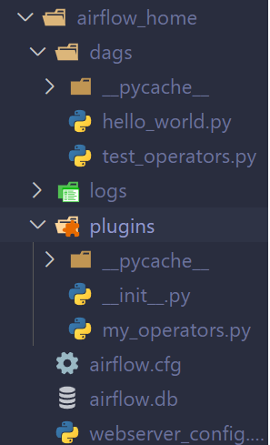

## Tutorial de uso de Airflow 1

### Cambios que tuve que realizar

##### Durante la instalacion

- Instalar virtualenv (en mi caso no lo tenia)
  `pip install virtualenv`

- El comando de instalacion del tutorial 
  ```pip install airflow == 1.8.0  ```
  esta deprecado usar: 
  `pip install apache-airflow` 

##### Para inicializar la db

- El comando `airflow initdb` esta deprecado usar: `airflow db init`

##### Cuando se quiere entrar a airflow
- Crear un usuario default admin admin
`airflow users  create --role Admin --username admin --email admin --firstname admin --lastname admin --password admin`

##### Cuando se quiere hacer import de un operator propio

En el tutorial te indican que hagas el import de manera

```python
from airflow.operators import MyFirstOperator
```

A partir de la version 2.0 de Apache Airflow los imports se tienen que hacer de la siguiente manera:

```python
from my_operators import MyFirstOperator
```

Donde la estructura de archivos se ve de esta forma:



##### Cuando se quiere testear una tarea dentro de un DAG

En el tutorial dice de usar

```bash
airflow test my_test_dag my_first_operator_task 2017-03-18T18:00:00.0`
```

La manera que se usa ahora es:

```bash
airflow tasks test my_test_dag my_first_operator_task 2022-05-24
```

##### Cuando se quiere importar BaseSensorOperator

En el bloque del tutorial se usa:

```python
from airflow.operators.sensors import BaseSensorOperator
```

La manera que se usar ahora es:

```python
from airflow.sensors.base import BaseSensorOperator
```


