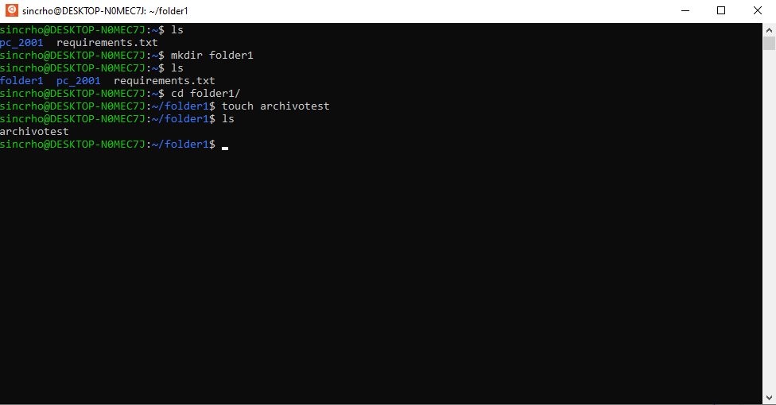
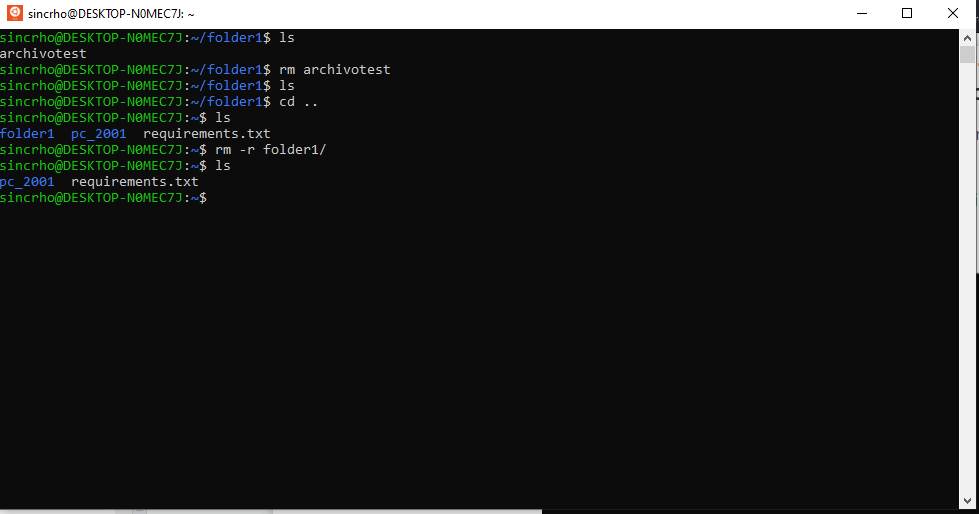
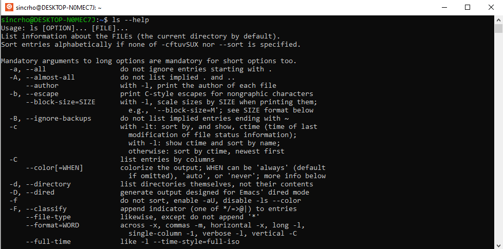
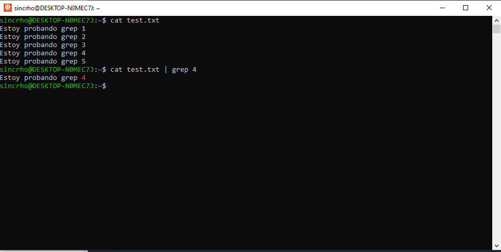
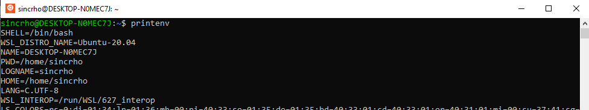
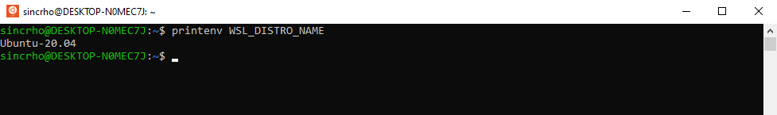
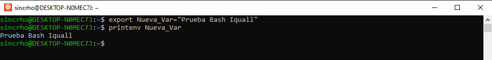
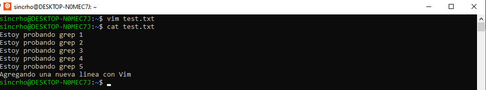
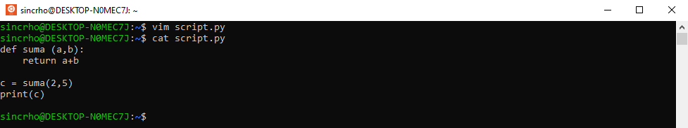
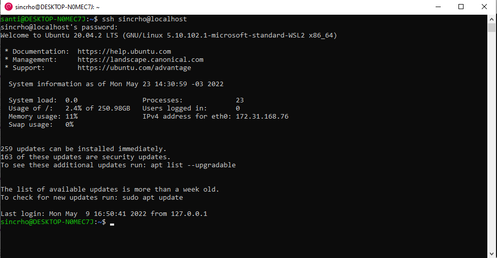

# Unidad 1 - Practicando bash

### Comandos principales: ls, pwd, mkdir, touch, cat, cd, rm

1. Usar mkdir para crear un directorio con un nombre sencillo (sin espacios ni tildes). 
2. Usar cd para movernos al directorio creado.
3. Usar touch para crear un archivo con un nombre sencillo (sin espacios ni tildes).
4. Usar ls para verificar que el archivo fue creado.
   

### Remover archivos y carpetas

5. Usar rm para borrar el archivo creado.
6. Hacer cd .. para retroceder un directorio.
7. Usar rm -r para borrar el directorio creado.

### Obtener ayuda acerca de un comando

8. Usar --help para obtener descripcion del comando ls 

### Uso de grep

9. Usando cat y grep 

### Variables de entorno

10. Mostrar variables de entorno con printenv  
11. Agregar una nueva variable de entorno 

### Vim

12. Editar un archivo con Vim 
13. Crear un archivo con Vim y pegar contenido en la consola 

### SSH

14. Ingresar mediante SSH 
